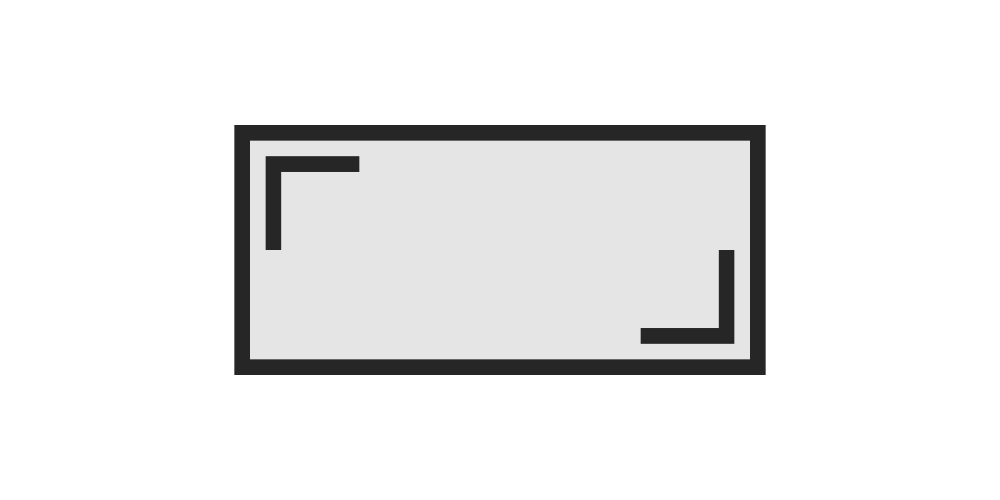

# responsive-aspect-ratio

> **Responsive elements with a fixed aspect ratio**.

Reserve the vertical space needed by responsive elements on your web document such as images or videos when they are still loading so you can avoid a cumulative layout shift.

## Usage

Simply include the script and add to the parent container of your responsive element a data attribute aspect-ratio with the desired aspect ratio (16:9, 1:1, 4:3...) as a value. For example: `data-aspect-ratio="16:9"`, `data-aspect-ratio="1:1"`, `data-aspect-ratio="4:3"`...

```html
<div data-aspect-ratio="21:9">
    <video controls autoplay loop src="https://test-videos.co.uk/vids/bigbuckbunny/mp4/h264/360/Big_Buck_Bunny_360_10s_1MB.mp4"></video>
</div>
```

```html
<picture data-aspect-ratio="16:9">
    <source srcset="https://placekitten.com/720/405" type="image/jpeg" />
    
</picture>
```

```html
<div data-aspect-ratio="4:3">
    <p>
        Lorem ipsum dolor sit amet, consectetur adipiscing elit. Quisque sed ante ac erat rutrum ornare auctor vitae nibh. Nam posuere euismod dui, mattis maximus augue molestie nec, in condimentum sem consectetur ut.
    </p>
</div>
```

## Info

This is based in the technique also known as the "padding hack" which defines the height of an element as a relative size to the width, taking advantage of the padding intrinsic properties. You probably have already seen it somewhere in some of its forms:

```css
[container] {
    position: relative;
}
[container]:before {
    display: inherit;
    content: '';
    padding-top: 56.25%; /* 16:9 ratio */
}
[content] {
    position: absolute;
    top: 0;
}
```

```less
[container] {
    position: relative;
    padding: ~"0 0 calc(100% / (16 / 9))"; // 16:9 ratio

    [content] {
        position: absolute;
        top: 0;
    }
}
```

## Further reading

- [New aspect-ratio CSS](https://web.dev/aspect-ratio/)
- [Cumulative Layout Shift (CLS)](https://web.dev/cls/), [Optimize Cumulative Layout Shift](https://web.dev/optimize-cls/)


## License

MIT License &copy; Jorge Moreno [@alterebro](https://twitter.com/alterebro), 2021.
